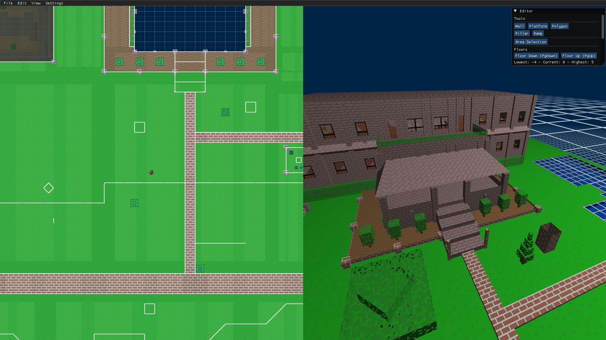
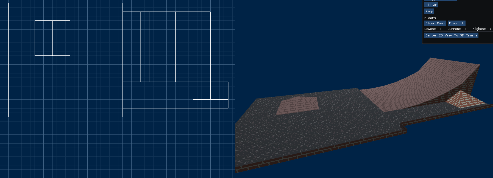
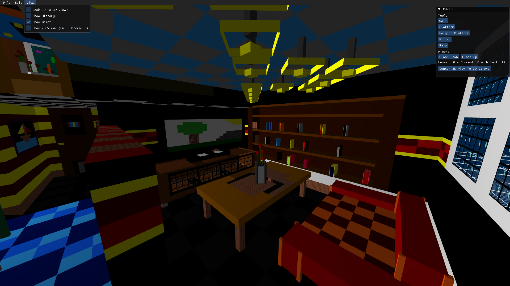

# ClassicYou

Recreation of the Shockwave based game and level creator [ChallengeYou](https://www.challengeyou.com/) created in 2007 by Kevin Manley, which has since unfortunately shut down due to the discontinioun of the Adobe Shockwave Player in web browsers in the late 2010's.

This project in particular is a reimagination of the "drag and drop" editor (Which in the original was called "aMazer", and later renamed "LevelCrafter"), which enabled the community to create "maze-like" games to share with an online community. These games were similar to Doom levels, where you must find keys to unlock doors and find the finish, collecting items along the way.

A huge shoutout to the reverse engineering effort by Ruixel who has recreated the game player, such that everyone can enjoy the games created back in late 2000's to the early 2010s! https://bagster.itch.io/yacy

## Features

### From the original game:

- Platforms
- Walls
- Ramps
- Pillars
- Multiple floors
-

New:

- No floor limit, in either direction
- No item limit
- Undo and redo functionality
- Corner ramps, tri-ramps, inverted tri-ramps
- Resizable ramps
- Coloured textures
- Most objects can have different textures on "both sides"
- More dynamic ramps and walls, with custom heights for start and end!
- JSON format for levels - potential for "programmable" level generation

### Planned

- Selecting multiple objects to copy/paste and move around
- Better rendering engine to support lighting
- Actually playable games
- Better 2D view (Currently it is just lines)
- Zooming in and out of the 2D view

## Screenshots





## Building and Running

### Windows (Visual Studio)

The easiest way to build is to use [vcpkg](https://vcpkg.io/en/index.html) and install dependencies through this:

```bash
	vcpkg install sfml
	vcpkg install imgui
	vcpkg install glm
	vcpkg install ctre
	vcpkg install nlohmann-json
	vcpkg install magic-enum

	# Integrate with Visual Studio
	vcpkg integrate install
```

Then open the Visual Studio project file to build and run.

### Linux

#### Pre-requisites

Install Vcpkg and other required packages using your distribution's package manager:

```sh
git clone https://github.com/microsoft/vcpkg.git
cd vcpkg
./bootstrap-vcpkg.sh

# These are required to build some packages
sudo apt install cmake make autoconf libtool pkg-config

# The following are required for SFML
sudo apt install libx11-dev xorg-dev freeglut3-dev libudev-dev
```

Ensure paths are set correctly:

```sh
export VCPKG_ROOT=/path/to/vcpkg
export PATH=$VCPKG_ROOT:$PATH
```

RECOMMENDED: Add the above lines to your `.bashrc` or `.zshrc` file:

```sh
echo 'export VCPKG_ROOT=/path/to/vcpkg' >> ~/.bashrc
echo 'export PATH=$VCPKG_ROOT:$PATH' >> ~/.bashrc
```

#### Build and Run

To build, at the root of the project:

```sh
vcpkg install # First time only
sh scripts/build.sh
```

To run, at the root of the project:

```sh
sh scripts/run.sh
```

To build and run in release mode, simply add the `release` suffix:

```sh
sh scripts/build.sh release
sh scripts/run.sh release
```

## Credits

--

Grass texture: https://opengameart.org/content/tileable-grass-textures-set-1

--
